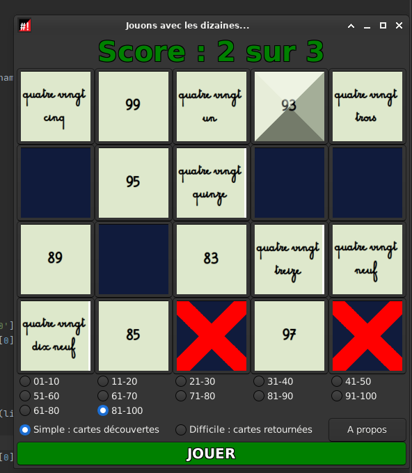

# Dizaines
Juste un petit utilitaire pour apprendre les correspondances lettrées / chiffres de 0 à 100.
Elèves GS,CP, CE1, EBEP.

En cours de deveppement

Pour l'instant, seul le niveau facile est réalisé.

Les messages de DEBUG sont toujours présents.

# Installation

```
git clone git@github.com:CyrilleBiot/dizaines.git
cd dizaines
./dizaines.py
```


# Screenshoots


